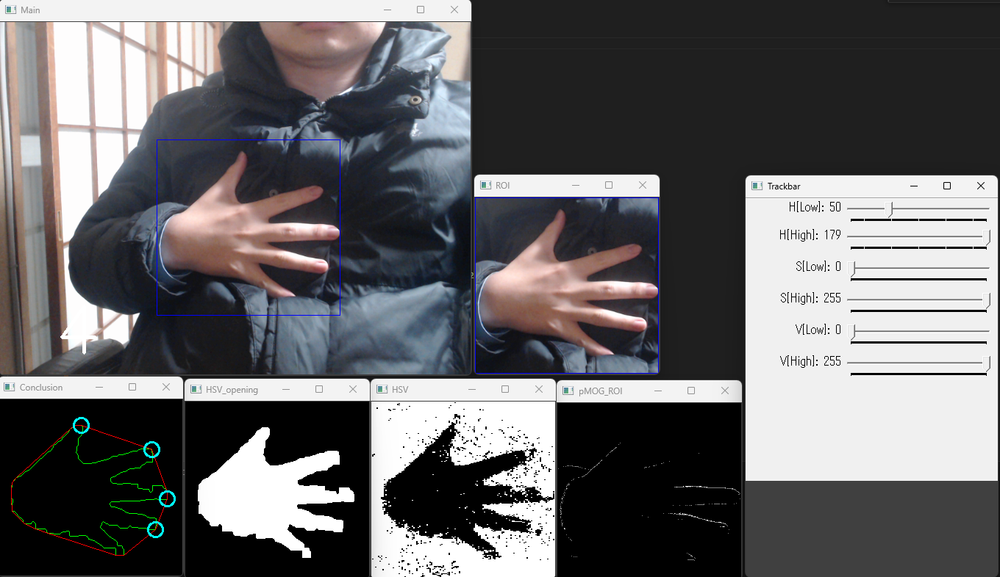

# Hand_RPS

 

Hand recognition and Rock-Paper-Scissors application using webcam + OpenCV.


## Purpose

Simplify hand recognition and apply it to embedded devices and augmented reality (AR).

<details>
    <summary><b>Goals</b></summary>
    <ul>
        <li>✅Check for the execution environment.</li>
        <li>✅Hand recognition</li>
        <li>❌Create the button UI.</li>
    </ul>
</details>

## Requirement

> [!NOTE]
> The versions as of developments are as below.

* Windows 11
* Logicool C922n
* OpenCV 4.5.1
* Bazel  6.0.0
    <details>
        <summary>Why use Bazel?</summary>
        Because <a href="https://developers.google.com/mediapipe">MediaPipe</a> was the first tool I learned about hand recognition.<br>
        And Bazel was used as a compiler for MediaPipe.<br>
        <p>
            <br>
            <strong>
                I plan to support CMake in the future.<br>
            </strong>
            There was a problem with embedded devices (e.g. Arduino).
        </p>
    </details>

## Getting Started

***1. Check for the execution environment.***

```bash
cd env-check
bazel build //src:test
cd bazel-bin/src
test.exe
```

* Your OpenCV version is displayed on the console.
* A live video from your webcam is displayed.(Quit : q)

***2. Check for your hand can be distinguished from the background within ROI.***



```bash
cd hand-recognition
bazel build //src:hand
cd bazel-bin/src
hand.exe
```
Adjust the HSV on the track bar so that your hand are clearly visible.

> [!CAUTION]
> If the background is close to your skin color, your hand and the background are not properly separated.

---

Thank you😉